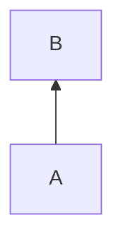

B is a definition, A uses B, then there is a def-use edge from B to A:



There are two categories of nodes in the ir:
 - Control nodes
 - Data nodes


## Language Design
### Macros/Metaprogramming
 - Janet (https://janet.guide/macros-and-metaprogramming/): allows upscoping defined variables in macros optionally (using `upscope`). This is very interesting, I think I should also have some kind of upscoping.

 - Carbon (programming language): imports macros from C/C++. This is always something to think about
```carbon
import Cpp inline "#define ADDITION 1+2+3";
```

 - Nim macros' results can be typed/untyped and the result is always called `result`. Their macros don't take outer identifiers (from what I understand)


